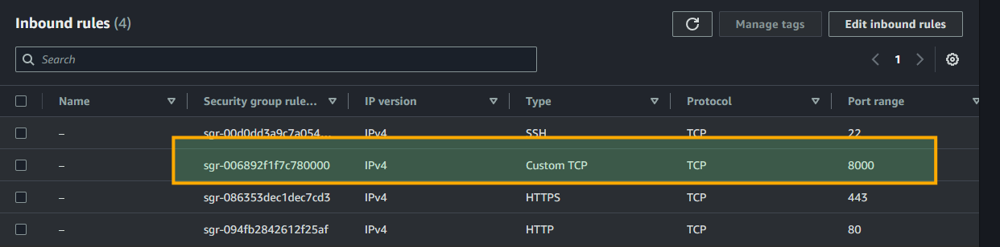
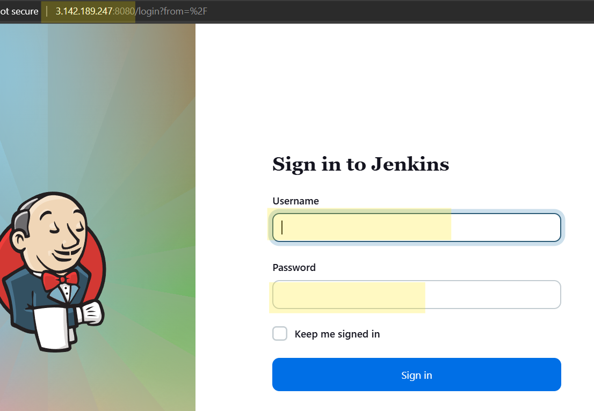
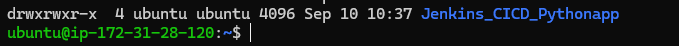
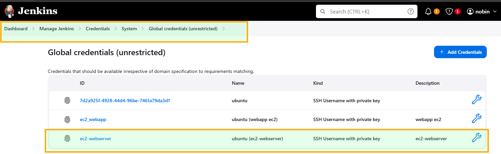
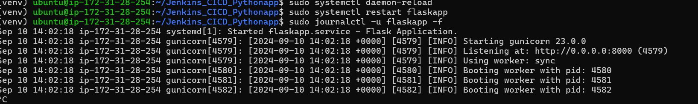
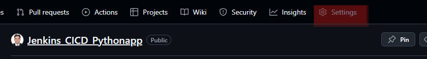
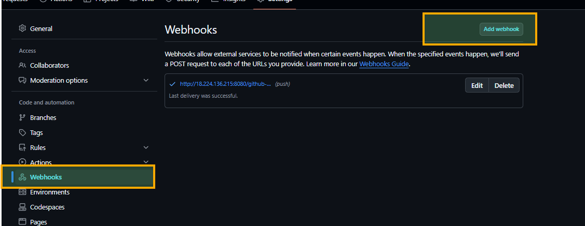
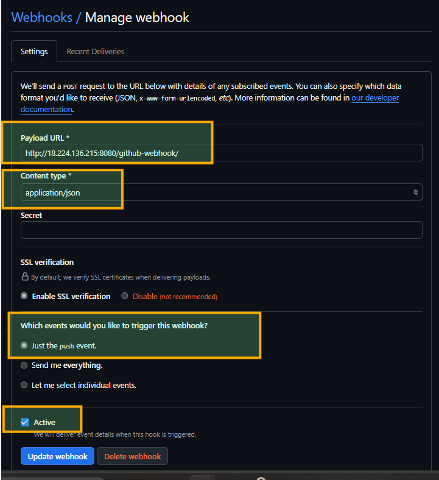
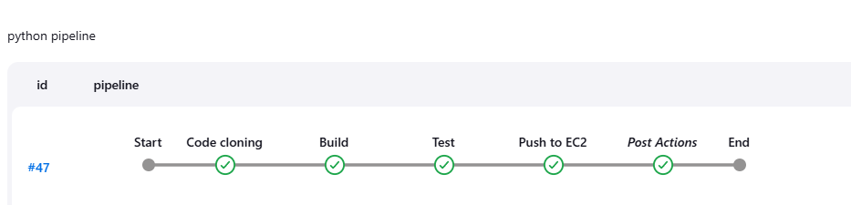
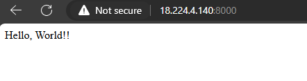

# Jenkins CI/CD Pipeline for Python Flask Application
This repository contains a Jenkins CI/CD pipeline configuration for deploying a Python Flask application. The pipeline automates the process of building, testing, and deploying the application to an AWS EC2 instance using Git, Jenkins, and systemd.

Table of Contents
Project Overview
Prerequisites
Pipeline Overview
Setup Instructions
Jenkins Pipeline Configuration
Systemd Service Configuration
Environment Variables
Troubleshooting
Contributing
License

Project Overview

This project demonstrates a complete CI/CD pipeline using Jenkins for a Flask web application. The pipeline includes stages for:

Cloning the code from GitHub.
Setting up a virtual environment and installing dependencies.
Running tests using pytest.
Deploying the application to an EC2 instance using SSH.
Managing the Flask application as a service using systemd.
Prerequisites
## Before setting up the pipeline, ensure the following:

Jenkins Installed: Jenkins must be installed and accessible.
necessay ports should be open (jenkins server and WEb server)

Jenkins Plugins:
Git Plugin
SSH Agent Plugin
Python & Flask: Python 3.x and Flask must be installed on your target EC2 instance.
GitHub Repository: A GitHub repository containing your Flask application.
AWS EC2 Instance: An EC2 instance set up to host your Flask application.
Pipeline Overview
The Jenkins pipeline consists of the following stages:

Code Cloning: Pulls the latest code from the GitHub repository.
Build: Creates a Python virtual environment and installs required packages.
Test: Runs the application's test suite using pytest.
Deployment: Pushes the updated code to the EC2 instance, installs dependencies, and restarts the Flask application.
##Setup Instructions
1. Clone the Repository
Clone the repository to your local machine:

bash
Copy code
git clone [https://github.com/yourusername/your-flask-app.git](https://github.com/Nobin1987/Jenkins_CICD_Pythonapp.git)
cd Jenkins_CICD_Pythonapp

2. Configure Jenkins Job
Open Jenkins and create a new pipeline job.
In the pipeline configuration, set the pipeline definition to "Pipeline script" and paste the pipeline code from this repository (usually located in Jenkinsfile).

3. Set Up Jenkins Credentials
Add your EC2 SSH credentials in Jenkins under Manage Jenkins > Credentials with the ID ec2_webapp.

4. Configure Systemd on EC2
Create a systemd service file for the Flask application:

bash
Copy code
sudo nano /etc/systemd/system/flaskapp.service
Paste the following configuration:

ini
Copy code
[Unit]
Description=Flask Application
After=network.target

[Service]
User=ubuntu
Group=www-data
WorkingDirectory=/home/ubuntu/your-flask-app
Environment="PATH=/home/ubuntu/your-flask-app/venv/bin"
ExecStart=/home/ubuntu/your-flask-app/venv/bin/gunicorn --workers 3 --bind 0.0.0.0:8000 app:app

[Install]
WantedBy=multi-user.target
Start and enable the service:

bash
Copy code
sudo systemctl daemon-reload
sudo systemctl enable flaskapp
sudo systemctl start flaskapp
Jenkins Pipeline Configuration
Here's a snippet of the Jenkins pipeline code used in this project:

5. Create webhook/Trigger

   	Create webhooks whenever new push is done on the github main branch   of the project.
to trigger so that Open the git hub repo, and open settings

Select webhooks and add Webhooks

## Troubleshooting
Service Failed to Start: Check the logs using sudo journalctl -u flaskapp.service.
Dependency Issues: Ensure the virtual environment is correctly activated and dependencies are installed.
SSH Failures: Ensure SSH keys are correctly configured and Jenkins has the proper access.
## Contributing
Contributions are welcome! Please create a pull request with detailed information on your changes.

## License
This project is licensed under the MIT License - see the LICENSE file for details.

